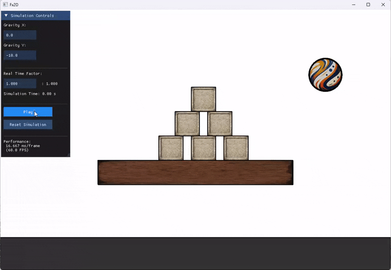
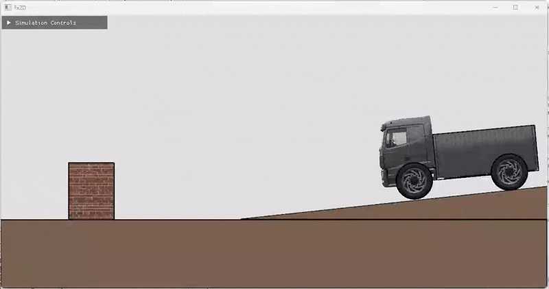

# Fx2D

A 2D physics simulator written in C++.

#### [Examples](./examples/)



## Key Features
- **SAT collision detection:** Efficient circle and polygon collision using the Separating Axis Theorem (SAT)
- **XPBD constraint solver:** Position-based dynamics with compliance control
- **Modern memory management:** Safe resource handling with `std::shared_ptr` / `std::unique_ptr`
- **YAML scene configuration:** Declarative setup of entities, textures, and physics parameters in `.yml` files
- **Dynamic scene modification:** Runtime manipulation of entities and constraints
- **FxArray & Math Utilities**: NumPy-style `FxArray` and comprehensive linear-algebra utilities in Fx2D/Math.h
- **raylib-based rendering:** Lightweight, cross-platform renderer with ImGui integration


## Dependencies

- **CMake** 3.16+ - Build system generator
- **Eigen3** 3.3+ - Linear algebra and math operations
- **raylib** 4.5+ - Scene rendering and graphics
- **yaml-cpp** - YAML parsing for scene configuration
- **ImGui** 1.92 - User interface framework
- **rlImGui** - Raylib-ImGui integration (included) 

## Building

### Method 1: CMake

```bash
cmake -S . -B build -DCMAKE_BUILD_TYPE=Release
cmake --build build -j$(nproc)
```

### Method 2: Using fxmake

```bash
chmod +x fxmake       # Make executable (Unix-like systems)
./fxmake              # Build in Release mode
./fxmake debug        # Build in Debug mode
./fxmake rebuild      # Clean and rebuild
./fxmake clean        # Clean build artifacts
```

## Quick Start

```cpp
#include "Fx2D/Core.h"

int main() {
    // Load scene from YAML
    auto scene = FxYAML::buildScene("./Scene.yml");
    
    // Initialize renderer with 60 FPS target
    FxRylbRenderer renderer(scene, 60);
    
    // Start the simulation loop
    renderer.run();
    return 0;
}
```

### Running Examples

To run an example, copy the `main.cpp` from `examples/` to `src/`, build the project, and ensure `Scene.yml` and assets are accessible to the executable.

```bash
./Fx2D      # Linux/macOS
./Fx2D.exe  # Windows
```

## License

BSD-3-Clause License

## Todo

- Add controllable joints
- Improve velocity resolution in collisions  
- Add dynamic AABB tree

## Contributing

Contributions are welcome! Please follow the existing code style and conventions.

